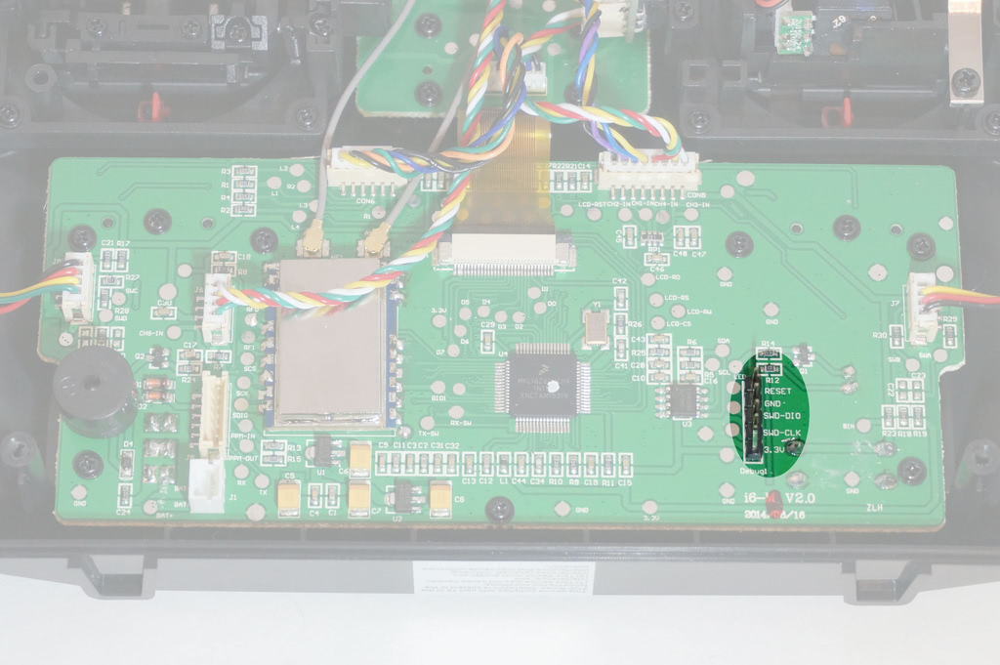
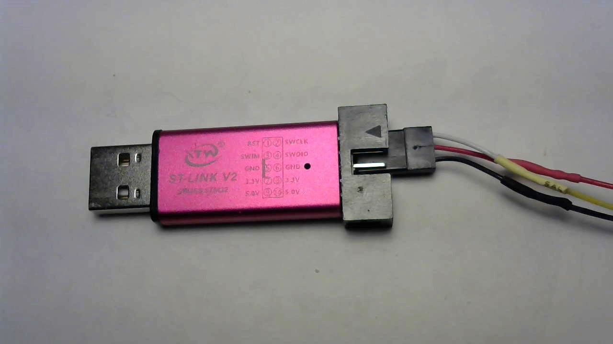

# Flashing the firmware

Precompiled images  are available on the [releases](https://github.com/sakitume/SilverLite-FS-i6/releases) page on github.
Three file formats (`.bin`, `.elf`, `.hex`) are provided; choose whichever one works best with the flashing software/tool
you have available.

## Hardware adapters
An ST-Link v2 or a J-Link adapter will be needed. Many ST-Link v2 clones are readily available on Ebay and Amazon. Unless you have a J-Link adapter
already or intend to debug with more than 2 breakpoints, purchasing an ST-Link adapter is the cheapest and simplest hardware solution.


The adapter will connect to the SWD (Serial Wire Debug) interface pins on the mainboard. Only three pins need connecting:

* SWDIO - Serial Wire Data I/O. Labeled "SWD-DIO" on the mainboard.
* SWCLK - Serial Wire Clock. Labeled "SWD-CLK" on the mainboard
* GND - Ground wire. Labeled "GND" on the mainboard.

A really good writeup (with pictures) on the FlySky FS-i6 can be found on Nathan Tsoi's [blog](https://nathan.vertile.com/blog/2016/07/09/flysky-i6-radio-setup-and-hacking-guide/). Here is a picture he took of the SWD interface port.




You'll use three "breadboard jumper wires" or sometimes called "Dupont" wires with female to female ends. Attach them to
the pins labeled "SWCLK", "SWDIO", "GND" as shown in this picture:



These pins are inline and adjacent to one another and are the top three pins on the rightmost column of pins when viewing from the pin side
of the adapter with the notch of the housing towards the left.


Connect these wires to their corresponding pins on the i6 mainboard. 

## OpenOCD
Please refer to the ["Setting up your development environment"](devEnvSetup.md) document and look for the "Installing OpenOCD on Windows"
or "Installing OpenOCD on Mac OS" sections for details on installing OpenOCD.

## Flash using OpenOCD with ST-Link adapter

Ensure your ST-Link adapter is wired to your i6 as described earlier. Plug your ST-Link adapter to an available USB port on your computer. Then
power up the i6 transmitter.

You'll use the `fs-i6.elf` version of the firmware file. Open a terminal or command prompt window and navigate to the folder that you downloaded 
(or copied) the `fs-i6.elf` file into. Then enter this command:

```
openocd -f interface/stlink.cfg -f target/klx.cfg -c "program fs-i6.elf verify reset exit"
```

> Note: Details about the OpenOCD `program` command can be found here: http://openocd.org/doc/html/Flash-Programming.html

## Flash using JLink
Please refer to the JLink software documentation for how to flash. I actually use my JLink adapter quite often but I do this
using a "Build Task" that I configured Visual Studio to use. More details about this can be found in the 
["Setting up your development environment"](devEnvSetup.md) section.

**Hint:** I use a JLink "CommanderScript" that might be of help. The "Build Task" in Visual Studio basically does this:

```
JLink -CommanderScript ../.vscode/load-release.jlink
```

You can review that `load-release.jlink` file for the parameters actually being used with the JLink tool.


