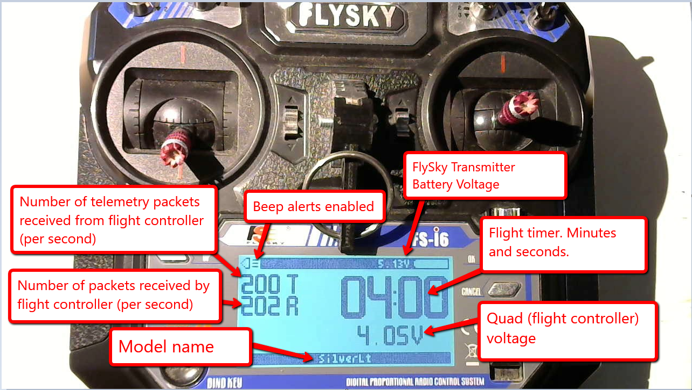
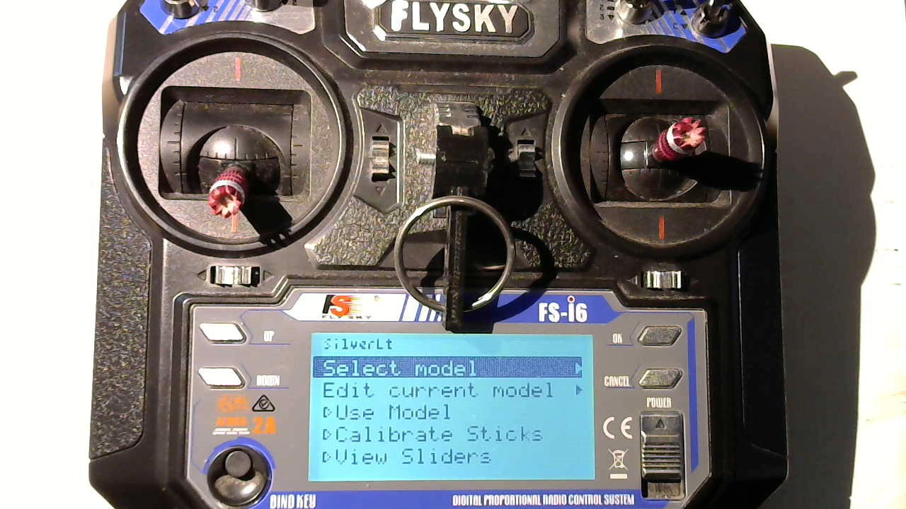
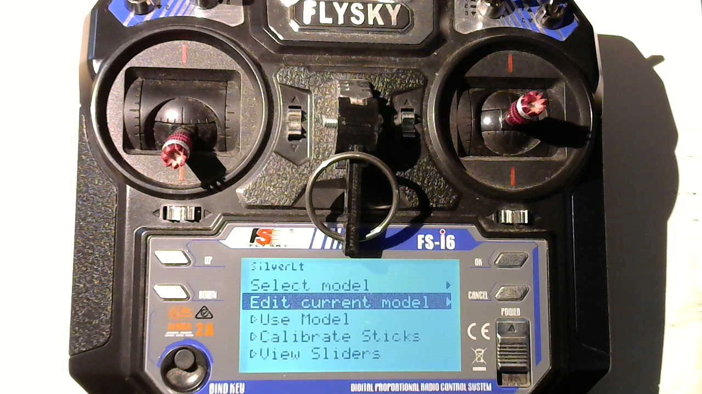
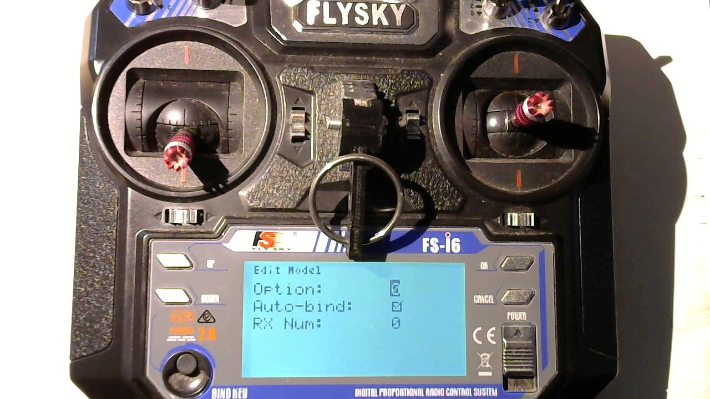
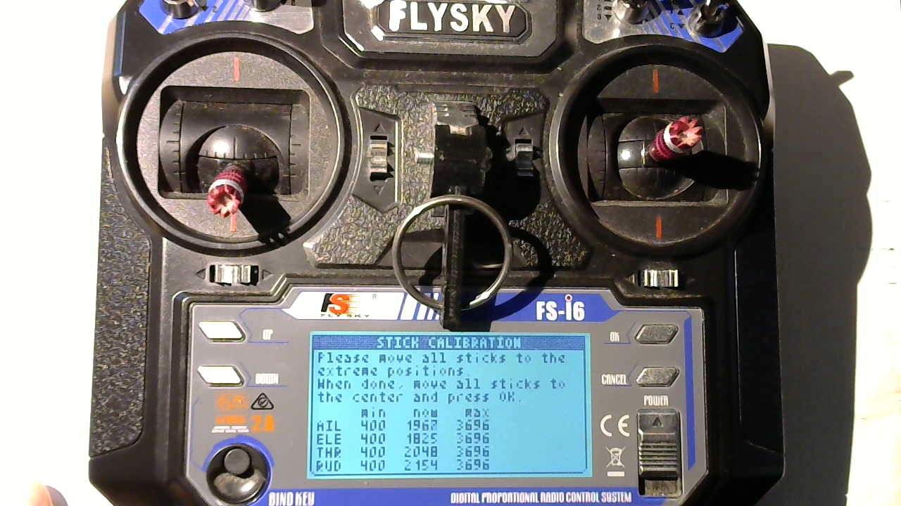
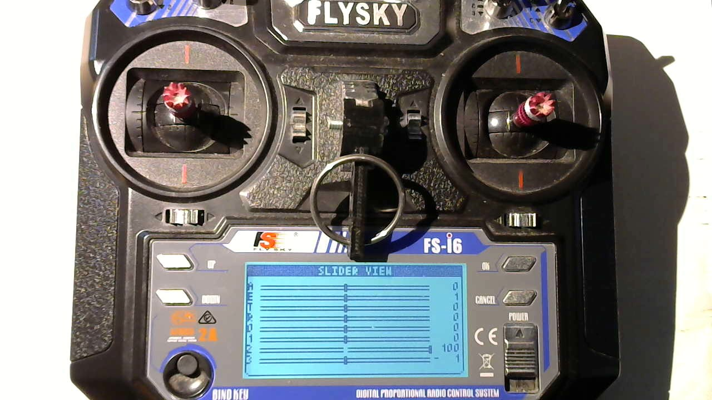
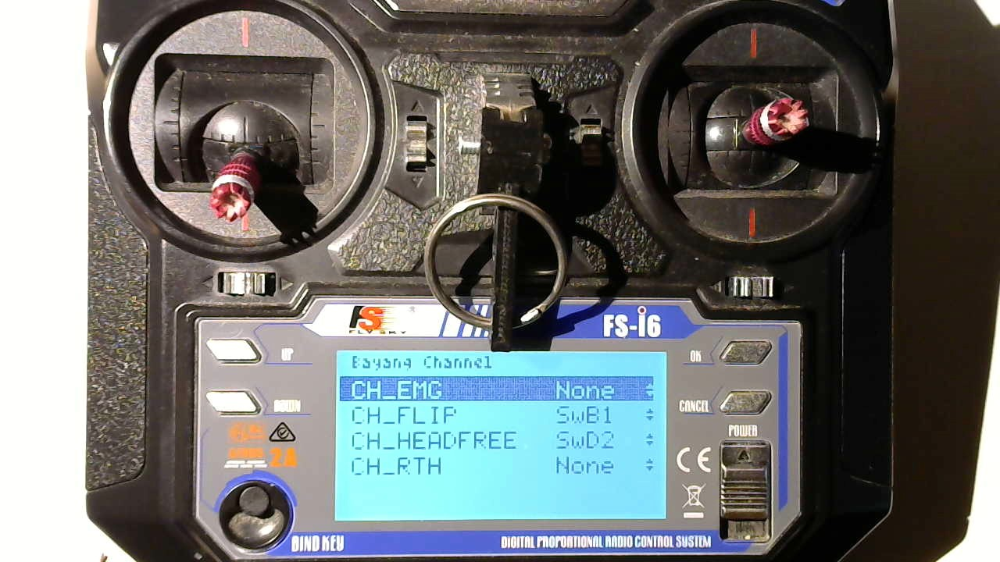
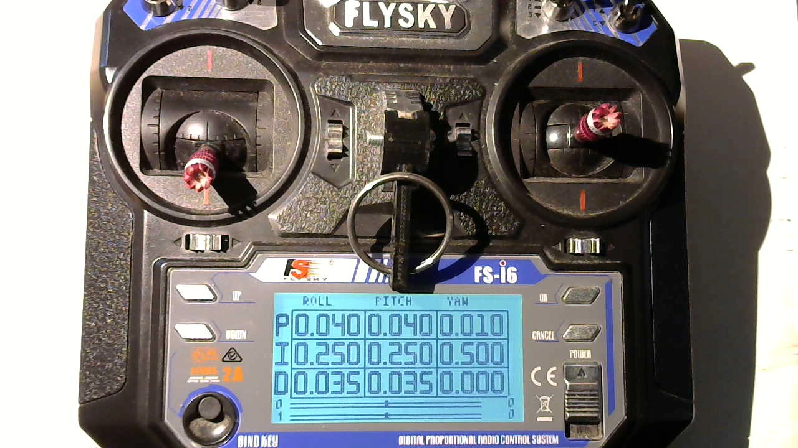

# On power up

When you turn on the TX it will load the last model that you used and enter "use" mode.
If your quad is already powered up and configured for auto-bind the LCD display will
resemble the following:

The menu display in "Use" mode is very simple consisting primarily of a large countdown timer, 
signal strength numbers and battery voltages. 

The name of the selected model is displayed on the bottom status bar. While the top status bar has 
a speaker icon on the left to indicate if sounds (beeps) are enabled or not. The TX battery voltage 
is displayed on the right of the top status bar.

## Exit to main menu
When in "Use" mode you can press the "Cancel" button to exit to the main menu. An alert dialog will
prompt you to press the "OK" button to exit to the main menu. Or you can press "Cancel" button to
dismiss the alert dialog and return to "Use" mode.

## Safe start
When entering "Use" mode (whether from powerup or from main menu), if the `SwA` or `SwD` switches are "Down" (position 2), 
or the throttle stick is not fully down, the TX will not arm and an "Alert" dialog is displayed instead.

Flip the switches up and/or push the throttle stick all the way down to exit the "Alert" dialog
and enter "Use" mode. Alternatively you can long press the "Cancel" button to exit the "Alert" dialog
and enter the main menu.

## The Main Menu

The main menu is where you can edit models and select one to use. You can also use this menu to
configure and review the sticks and aux channels.

You use the push buttons on the FlySky to navigate the menu:

* Ok        - Used to confirm or activate a selection
* Cancel    - Used to cancel an operation or back up out of a menu level
* Up        - Used to move up in a menu list
* Down      - Used to move down in a menu list
* Yaw Trim  - This button can be pushed to the left to back out of some menu options, or to the right to activate certain menu options. It can also be used to decrement or increment a value in the menu (such as a letter field or a number field). And it can also be used to move left/right within a multi character (or digit) field.

### Select model
At the top of the main menu screen will be displayed the currently selected model name. Use
the up/down buttons to hilite the "Select model" option and then press the "OK" button
or you can push the "Yaw Trim" button towards the right to activate the option.

The menu will then list the available models.

Use the up/down buttons to hilite your selection. If you go past the last entry the menu will
advance to the next page of models. There are a total of 10 models.

Use the "OK button to activate your selection. Or use the "Cancel" button to back out of the menu.
Or you can hilite the first item in the list (which is a left arrowhead) and press "OK" to back
out of this menu.

### Edit model
As mentioned previously, the name of the currently selected model is displayed at the top of the main menu.
To edit this model select and activate the "Edit current model" option.

This will switch to the "Edit model" submenu. This submenu has two screens that will let you edit various properties of the model.

The first page has the menu options:

* Name
    * Model names are limited to 9 characters in length. Upper case and lower case letters are allowed: `a..z`, `A..Z`.
    Numbers `0..9` are allowed. And the space and hyphen characters: `" "`, `"-"`.
* Seconds:
    * This is the number of seconds used for the flight countdown timer.
* Protocol:
    * Here you can choose either the internal (NRF24L01) Bayang protocol, or one of the Multiprotocol Module protocols that were
    enabled when SilverLite was built.
* Subprotocol:
    * The available options are based on which "Protocol" was selected
        * For "Internal" protocol the options are:
            * Stock - This is a stock Bayang protocol (2ms period)
            * Silverware - This is a Bayang protocol for Silverware flight controllers (3ms period or 5ms if telemetry enabled). Note: SilverLite extensions are available if "Options" is set to 7
            * LT8900 - This is like the "Silverware" subprotocol and should only be used if the flight controller is using an LT8900 transceiver instead of an NRF24L01 or XN297/XN297L transceiver.
        * All other Subprotocol options are dependent on the chosen Multiprotcol "Protocol"
            

The second page of the "Edit model" menu has these options:

* Option:
    * When "Internal" is used for "Protocol" then this is a number that can enable certain features. Add the numbers below to combine several features.
        * 0 - No additional features
        * 1 - Enable telemetry
        * 2 - Analog aux channels (`VrA` and `VrB`) will be used for P and D term tuning ("Subprotocol" must be set to "Silverware").
        * 4 - Enable SilverLite extensions if flight controller firmware supports SilverLite ("Subprotocol" must be set to "Silverware").
 
* Auto-bind:
    * This is used by the external Multiprotocol Module
* RX Num:
    * This is used by the external Multiprotocol Module
* Arm Switch:
    * This is only used by the flight countdown timer. Timer is paused if arm switch is in off position.
* [Bayang Channels](#bayang-channels)
    * This takes you to another menu screen where you can specify which FlySky FS-i6 switches correspond to [Bayang auxliary channels](#bayang-channels).

### Use model
The third option on the main menu is "Use model". Select and activate this option to begin using the currently selected model.

### Calibrate Sticks
The fourth option on the main menu is "Calibrate Sticks". Select and activate this option to calibrate the gimbals through their
entire range of motion. 

Follow the directions and press "OK" to apply changes and exit. Or press "Cancel" to discard your changes and exit.

> Note: Ignore the numbers that are displayed. Just follow the directions

### View Sliders

The fifth option on the main menu is "View Sliders". Select and activate this option to view the AETR channels,
analog aux channels (`VrA` and `VrB`) and two *analog* switches (`SwB` and `SwC`) as slider bars. Move your
sticks, rotate those knobs and flip those switches to see the sliders in action.

## Bind

When in "Use" mode you can press the "BIND KEY" button to activate bind mode. An alert dialog is displayed
asking you to confirm that you really want to bind. Press and hold the "OK" button for about a second to confirm 
and enter a bind mode or press "Cancel" button to abort.

> Note: The bind mode only lasts for a little less than a second. This seems long enough for both Bayang and FlySky receivers.

## Beeps

Yes, I hooked up some beep alerts. But I don't really like them. Tap the "OK" button when in "Use" mode to toggle
them on/off. The top left corner of the LCD screen shows a cheezy speaker icon with sound on/off to indicate whether
beeps are enabled or not.

If I remember correctly I think they are:

* Double-beeps during last 15 seconds of flight timer to signal that the timer is close to expiring.
* More beeps (I forget what they sound like) when quadcopter battery voltage (as reported by telemetry) drops below some hardcoded value in the code

## Bayang Channels

The Bayang Channels submenu is used to configure which FlySky FS-i6 switches (and their respective positions) map to various Bayang auxliary channels.
These Bayang auxiliary channels are defined in the Silverware source code (see the `defines.h` file). There are a total of 8 Bayang auxiliary channels that you can work with. 

* `CH_INV`
* `CH_VID`
* `CH_PIC`
* `CH_TO`
* `CH_EMG`
* `CH_FLIP`
* `CH_HEADFREE`
* `CH_RTH`

> Note: Silverware defines an additional `CH_EXPERT` channel but its usage is a bit awkward so I don't expose it in SilverLite

It is important for you to understand which of these channels is used by your Silverware flight controller, and for what purpose.
This requires a careful review/study of the Silveware source code, usually the `config.h` file.

For my BWhoop B03 Pro whoops that run [NFE Silverware](https://github.com/NotFastEnuf/NFE_Silverware) I edited my Silveware `config.h`
file so that the features (listed below) are mapped to a Bayang aux channel which in turn is mapped to a TX switch.

| Feature      | Channel      | Switch |
| ------------ | ------------ | ------ |
| ARMING       | CH_INV       | SwA(2) |
| LEVELMODE    | CH_FLIP      | SwB(1) |
| RACEMODE     | CH_PIC       | SwC(2) |
| HORIZON      | CH_VID       | SwC(3) |
| CH_HEADFREE  | IDLE_UP      | SwD(2) |

To change any of the switch assigments use the "Up" and "Down" buttons to select a channel then
press the "OK" button to begin editing that channel: Use the "Up"/"Down" buttons to select a
switch and its position, or chose "None" to indicate that channel isn't used.

> Note: The `SwC` switch is a three position switch. So in addition to the position 1, 2 and 3
options you can also select the 1+2 or 2+3 options. For example, `SwC1+2` means if the switch
is in either position 1 or 2 then turn on the assigned aux channel.

## PID Tuning

TODO: Placeholder. Need to describe PID tuning but it is currently in a state of flux.
So a screenshot for now.

