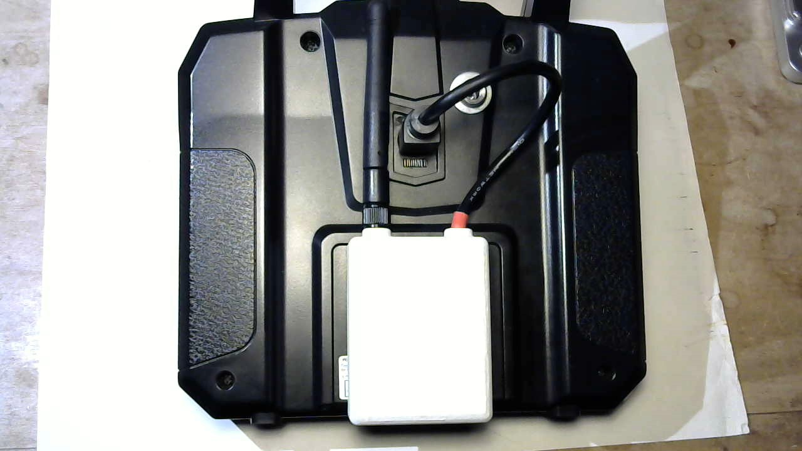

# This is a placeholder

* Describe how multiprotocol module is supported via serial (trainer port).
* Describe how list of available protocols is currently limited due to menu system awkwardness
* TODO: Mapping of i6 aux channels to multiprotocol channels

